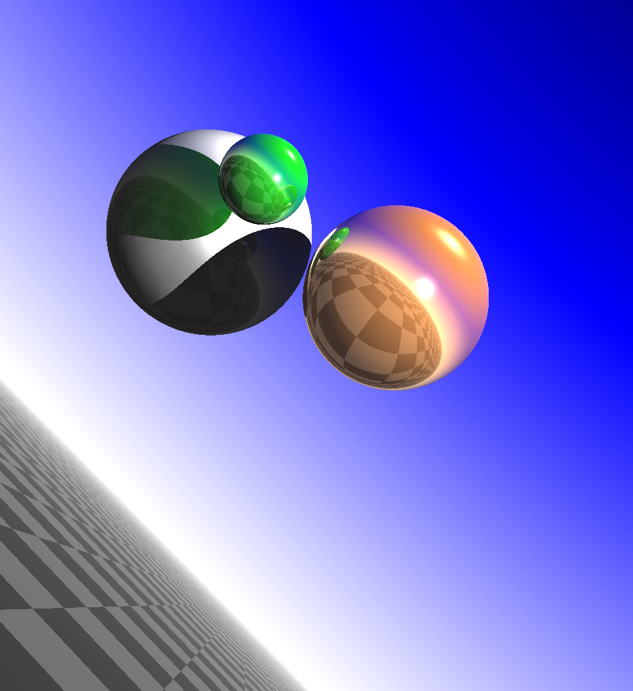
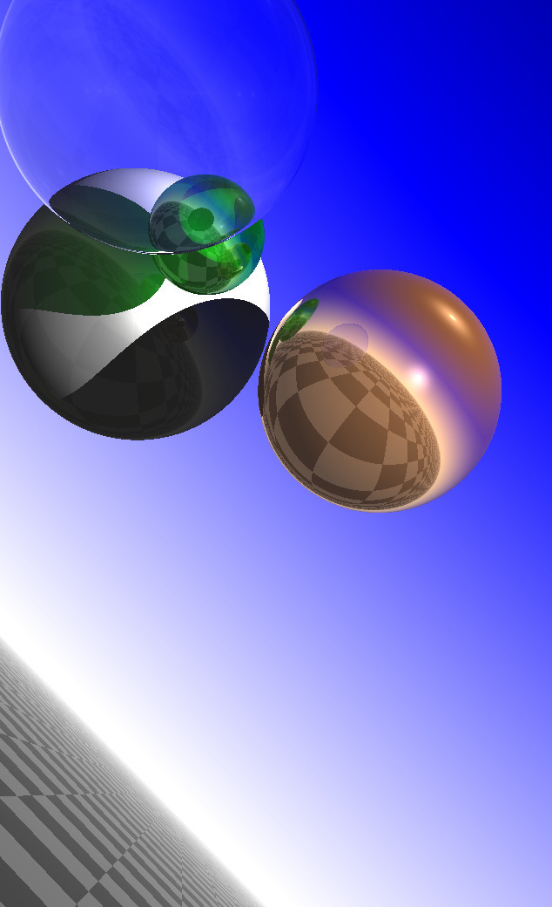
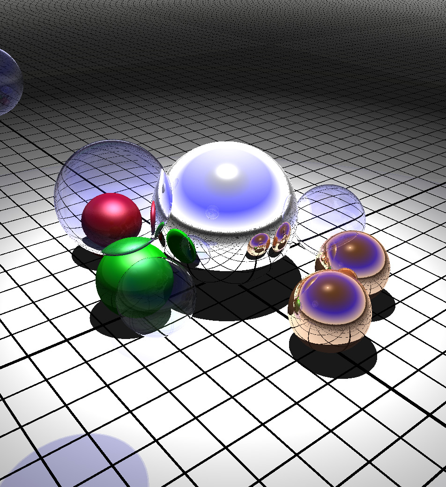

# avancement:
  - [X] 3 - Rendu primitif des sphères
    - [X] 3.1 - Intersection rayon / sphère
    - [X] 3.2 - Rendu minimal, intersection avec l'objet le plus proche sur le trajet du rayon.
    - [X] 3.2 - Rendu minimal, intersection avec l'objet le plus proche sur le trajet du rayon.
    - [X] 3.4 - Couleurs diffuses
    - [X] 3.5 - Couleurs spéculaires
    - [X] 3.6 - Un fond moins triste

  - [X] 4 - Ombres, réflexions, réfractions
    - [X] 4.1 - Ombres portées
    - [X] 4.2 - Réflexions
    - [X] 4.3 - Réfractions
    - [X] 4.4 - De l'influence de la profondeur de réflexion / réfraction
    - [X] 4.5 - Il est temps de jouer !

  - [ ] 5 Allez plus loin, allez plus haut !
    - [X] 5.1 Un nouvel objet graphique: le plan infini
    - [ ] 5.2 Une variante du plan infini, l'eau calme
    - [ ] 5.3 Anti-aliasing et problèmes numériques
    - [ ] 5.4 Un nouvel objet graphique : le triangle
    - [ ] 5.5 Mettre des textures sur les triangles
    - [ ] 5.6 Rendu rapide par décision aléatoire
    - [ ] 5.7 Faire un film
    - [ ] 5.8 Faire un ciel

# Utilisation du programme:
##### programme par default
  ```sh
  ./ray-tracer <scene> <material> #charge un scene avec ses materiaux
  ./ray-tracer                    #charge la scene par default (scene1)
  ```

# Rendu:



